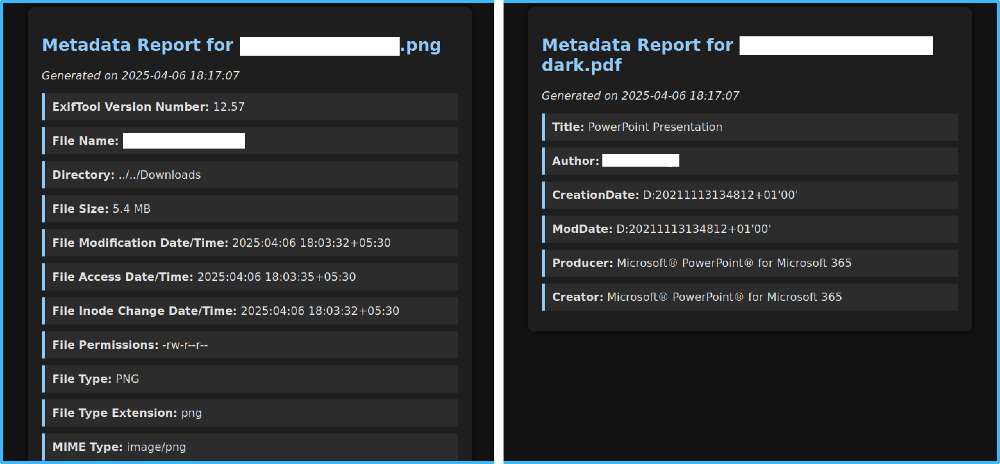

# FileIntel

A lightweight Python-based CLI tool to extract metadata from files like `.pdf`, `.docx`, images, and more. This tool can also generate a folium map or gmap link using exact coordinates and supports output in both **JSON** and **HTML** formats.

### Demo



## Installation

1. **Clone the repo** (or copy the script)
   ```bash
   git clone https://github.com/cx48/FileIntel
   cd FileIntel
   ```

2. **Create a virtual environment** (recommended)
   ```bash
   python3 -m venv venv
   source venv/bin/activate
   ```

3. **Install dependencies**
   ```bash
   pip install -r requirements.txt
   ```

4. **Install `exiftool`** (used for image and general file metadata extraction)

   - **Debian/Ubuntu**
     ```bash
     sudo apt install libimage-exiftool-perl
     ```

   - **macOS** (via Homebrew)
     ```bash
     brew install exiftool
     ```

   - **Fedora/RHEL**
     ```bash
     sudo dnf install perl-Image-ExifTool
     ```

   - **Verify Installation**
     ```bash
     exiftool -ver
     ```

   > If `exiftool` isn't installed, image and certain file types will not yield full metadata.

## Usage

#### Scan a single file
```bash
python fileintel.py file.docx
```

#### Scan all files in a folder
```bash
python fileintel.py ./documents/
```

#### Generates a offline folium map

```bash
python fileintel.py file.jpg --map
```

#### Create a gmap link using exact coordinates

```bash
python fileintel.py file.jpg --gmaps
```

#### Output HTML report
```bash
python fileintel.py file.pdf --html
```

#### Output JSON report
```bash
python fileintel.py image.jpg --json
```

#### Generate all reports, hashes, and maps
```bash
python fileintel.py file.pdf --all
```

> All reports are saved inside a `report/` folder with subdirectories per file.

## Supported File Types

- `.docx` (Word Documents)
- `.pdf` (PDF Documents)
- `.jpg`, `.jpeg`, `.png`, `.tiff`, `.heic`
- `.mp4`, `.mov`, `.3gp`, `.arw`, `.cr2`, `.dng`, etc
- Other formats supported by `exiftool`

## License

```
MIT License

Copyright (c) 2025 cx48

Permission is hereby granted, free of charge, to any person obtaining a copy
of this software and associated documentation files (the "Software"), to deal
in the Software without restriction, including without limitation the rights
to use, copy, modify, merge, publish, distribute, sublicense, and/or sell
copies of the Software, and to permit persons to whom the Software is
furnished to do so, subject to the following conditions:

The above copyright notice and this permission notice shall be included in all
copies or substantial portions of the Software.

THE SOFTWARE IS PROVIDED "AS IS", WITHOUT WARRANTY OF ANY KIND, EXPRESS OR
IMPLIED, INCLUDING BUT NOT LIMITED TO THE WARRANTIES OF MERCHANTABILITY,
FITNESS FOR A PARTICULAR PURPOSE AND NONINFRINGEMENT. IN NO EVENT SHALL THE
AUTHORS OR COPYRIGHT HOLDERS BE LIABLE FOR ANY CLAIM, DAMAGES OR OTHER
LIABILITY, WHETHER IN AN ACTION OF CONTRACT, TORT OR OTHERWISE, ARISING FROM,
OUT OF OR IN CONNECTION WITH THE SOFTWARE OR THE USE OR OTHER DEALINGS IN THE
SOFTWARE.
```
